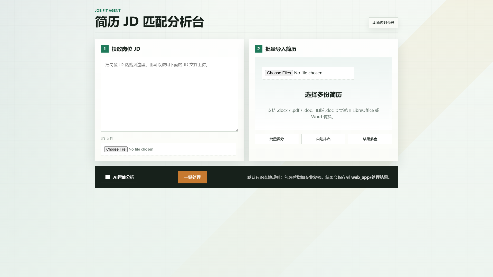

# Job Fit Agent

一个面向招聘筛选场景的简历与岗位 JD 匹配分析工具。项目支持批量读取简历，抽取候选人技能，与岗位要求进行结构化匹配评分，并输出可解释的优势、短板、建议和排名报告。

这个项目适合放在简历里作为 AI 应用开发 / Python 后端方向项目：它不是单纯调用大模型，而是把文件解析、规则评分、Web 上传、报告导出和可选 AI 分析串成了一条完整应用链路。

## 界面预览



## 核心能力

- 批量解析简历：支持 `.docx`、`.pdf`、`.doc`。
- 岗位匹配评分：根据技能覆盖、类别权重和缺口计算可解释分数。
- 技能归一化：将 `embedding`、`向量检索` 等表达归一到统一技能标签。
- 本地规则兜底：没有模型 Key 也能完成完整分析。
- Web 页面操作：上传 JD 和多份简历，直接查看结果。
- 报告导出：生成 JSON、Markdown、Word 详细报告和 Excel 排名表。
- 可选 AI 分析：勾选后调用模型补充候选人评价，也可生成批量汇总报告。

## 技术栈

- Python
- FastAPI
- Jinja2
- python-docx
- pypdf
- openpyxl
- httpx
- OpenAI / DeepSeek 兼容模型接口

## 目录结构

```text
job-fit-agent/
  app.py                 # 命令行入口，负责批量分析和终端报告
  tools.py               # 文件读取、技能抽取、匹配评分等核心逻辑
  prompts.py             # AI 总结提示词
  requirements.txt       # Python 依赖
  examples/              # 示例 JD 和示例简历
  tests/                 # 核心逻辑测试
  web_app/               # FastAPI Web 应用
    main.py              # Web 后端入口
    templates/           # Jinja2 页面模板
    static/              # CSS、JS、静态资源
    ai_config/           # AI 配置说明
    处理结果/             # Web 分析导出结果
  dev_resources/         # 本地辅助资料，不属于项目运行主体
```

## 快速运行

安装依赖：

```bash
pip install -r requirements.txt
```

运行命令行版本：

```bash
python app.py
```

运行演示流程：

```bash
python app.py --demo --debug
```

启动 Web 页面：

```bash
uvicorn web_app.main:app --reload
```

浏览器访问：

```text
http://127.0.0.1:8000
```

## Web 使用方式

1. 在左侧粘贴或上传岗位 JD。
2. 在右侧批量上传候选人简历。
3. 点击“一键分析”查看匹配分、优势、短板和建议。
4. 下载 JSON、Markdown、Word 或 Excel 报告。
5. 需要模型补充时，勾选“AI智能分析”或点击“写汇总报告”。

默认不会调用 AI；只有勾选 AI 功能或点击汇总报告时才会读取模型配置。

## AI 配置

Web 端推荐在 `web_app/.env` 中配置：

```text
WEB_AI_PROVIDER=openai
WEB_AI_API_KEY=your_api_key_here
WEB_AI_BASE_URL=https://api.deepseek.com/v1
WEB_AI_MODEL=deepseek-chat
```

也兼容根目录 `.env` 的通用变量：

```text
OPENAI_API_KEY=your_api_key_here
OPENAI_BASE_URL=https://api.deepseek.com/v1
MODEL_NAME=deepseek-chat
USE_LLM_SUMMARY=1
```

真实 Key 不要提交到仓库。

## 测试

```bash
python -m unittest discover -s tests -v
```

## 简历项目讲法

可以这样介绍：

> 我做了一个简历与岗位 JD 匹配分析系统。它先通过本地规则解析简历和 JD，抽取结构化技能，再根据岗位技能权重计算匹配分，并输出候选人的优势、短板和改进建议。Web 端支持批量上传、进度反馈和报告导出；在需要更自然表达时，可以调用大模型生成补充分析和汇总报告。这个设计保留了规则评分的稳定性和可解释性，也结合了大模型的文本总结能力。

## 当前边界

- 技能抽取主要基于规则词表和别名匹配，语义泛化能力有限。
- 评分权重来自人工设定，还没有基于真实招聘数据校准。
- `.doc` 文件依赖本机 LibreOffice 或 Microsoft Word 转换能力。
